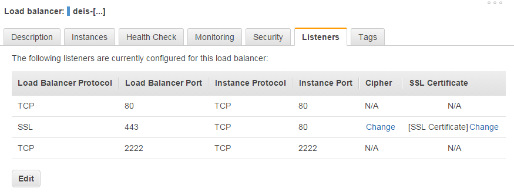

:title: Using WebSockets
:description: Learn how to enable WebSockets on your Deis installation

.. _configure-websockets:

Configure WebSockets
=========================
The Deis platform supports WebSockets out of the box, however, most Deis deployments have a load
balancer in front of the Deis :ref:`router`, as seen in the diagram:

.. image:: DeisLoadBalancerDiagram.png
    :alt: Deis Load Balancer Diagram

The load balancer in front of Deis must also support WebSockets in order to have a fully working
WebSockets environment on  your Deis deployment. `Amazon Elastic Load Balancer`_,
`Rackspace Cloud Load Balancer`_, and possibly other providers' load balancers does not support
WebSockets out of the box without switching the load balancers transport protocol from **HTTP** to
**TCP**.

.. _`Amazon Elastic Load Balancer`: https://forums.aws.amazon.com/thread.jspa?threadID=84606
.. _`Rackspace Cloud Load Balancer`: https://community.rackspace.com/products/f/25/t/3362

AWS (EC2)
----------
To enable WebSocket support on your Deis cluster running on AWS, you have to change the
`ELB Listener configuration`_ *Load Balancer Protocol* from *HTTP* to *TCP* on port 80.
If have SSL enabled, you must also change from HTTPS to SSL, like in the below image:

With that set, WebSockets should simply "just work". However, changing from *HTTP* to *TCP* will
make you lose information on the requests IP origin, as seen in the below header sample:

.. code-block:: text

	GET / HTTP/1.1
	Host: app.example.org
	[...]
	X-Forwarded-For: 10.21.26.115

And the same would be observed in the :ref:`router` logs:

.. code-block:: text

	[INFO] - [17/Dec/2014:20:36:35 +0000] - 10.21.26.115 - - - 200 - "GET / HTTP/1.1" [...]

One can solve this by enabling the PROXY Protocol, by following the below steps. The steps may
cause some down time, but it should be less then 5 minutes.

Step 1. Execute contrib/ec2/setup-proxy-protocol.sh
~~~~~~~~~~~~~~~~~~~~~~~~~~~~~~~~~~~~~~~~~~~~~~~~~~~

In ``contrib/ec2`` the script ``setup-proxy-protocol.sh`` will automatically set up everything both
on AWS and in your Deis Cluster.

.. code-block:: console

	$ cd contrib/ec2
	$ ./setup-proxy-protocol.sh

if you ran ``./provision-ec2-cluster.sh`` with a custom cloudformation stack name, you need to 
provide that to ``./setup-proxy-protocol.sh`` as well.

Step 2. Test that everything works
~~~~~~~~~~~~~~~~~~~~~~~~~~~~~~~~~~

Requests should now contain a proper ``X-Forwarded-For`` IP:

.. code-block:: text

	GET / HTTP/1.1
	Host: app.example.org
	[...]
	X-Forwarded-For: 129.164.129.164

and the same should apply for the :ref:`router` logs:

.. code-block:: text

	[INFO] - [17/Dec/2014:20:36:35 +0000] - 127.164.129.164 - - - 200 - "GET / HTTP/1.1" [...]

.. _`ELB Listener configuration`: http://docs.aws.amazon.com/ElasticLoadBalancing/latest/DeveloperGuide/elb-listener-config.html

Rackspace
---------
Rackspaces Cloud Load Balancer does not support WebSockets out of the box. By changing the protocol
from HTTP(S) to TCP_CLIENT_FIRST, WebSockets should work.

``X-Forwarded-For`` will be incorrect, and Rackspace does not currently support the PROXY protocol.

An alternative solution would be to have one load balancer use HTTP, and then another load balancer
for the websocket specific part of the application set to ``TCP_CLIENT_FIRST``.

DigitalOcean
------------
The current DigitalOcean setup uses DNS based load balancing, meaning that there is not an
intermediate load balancer between the end user/customer and Deis. WebSockets should work
out of the box with proper ``X-Forwarded-For`` headers being sent to your applications.
